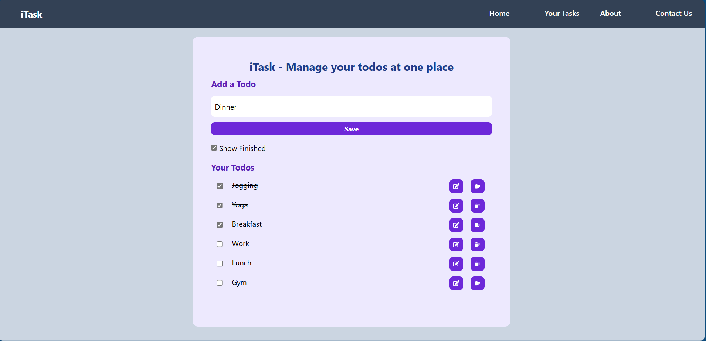
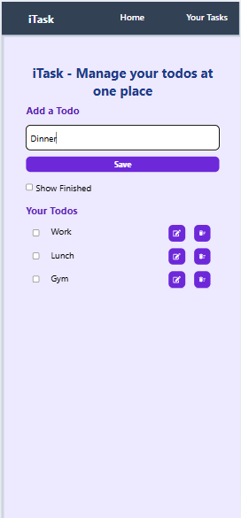

# 📝 iTask - A Minimal, Clean Todo Manager Built with React

**iTask** is a simple yet powerful todo app built using **React + Vite**, designed to help you manage your daily tasks efficiently. Add, edit, delete, and mark your todos — all with a clean and responsive interface.

---

## ✨ Features

- ✅ **Add todos** with a single click
- ✏️ **Edit in-place**: Modify any existing todo without losing its state
- ❌ **Delete** unwanted tasks
- ✔️ **Mark as complete/incomplete**
- 👁️ **Toggle visibility** of completed tasks
- 📅 **Persistent storage** using `localStorage`
- 📱 **Fully responsive** design for mobile, tablet, and desktop

---

## 📸 Screenshots

|        Desktop View     |        
  

|        Mobile View      |
  


---

## 💡 Technologies Used

- ⚛️ React (with Hooks)
- ⚡ Vite (blazing fast dev environment)
- 🧠 UUID (for generating unique IDs)
- 🎨 Tailwind CSS (for styling)

---

## 🚀 Getting Started

### 1. Clone the repo

```bash
git clone https://github.com/your-username/itask-todo-app.git
cd itask-todo-app
```

### 2. Install dependencies

```bash
npm install
```

### 3. Start the dev server

```bash
npm run dev
```

---

## 📱 Responsive Design

The UI is built using **Tailwind CSS**, making the layout fully responsive and mobile-first. Whether you're on a phone, tablet, or desktop, your tasks are always within reach.

- Mobile-friendly input and button spacing
- Flexible layout with adaptive widths
- Smooth experience across all screen sizes

---

## 📂 Folder Structure

```
src/
│
├── components/
│   └── Navbar.jsx       # Simple top navigation
│
├── App.jsx              # Main app logic and UI
├── main.jsx             # Entry point
└── assets/              # Logos and images
```

---

---

## 🧑‍💻 Author

Built with ❤️ by Subham Maity

---

## 📄 License

This project is open-source and available under the [MIT License](LICENSE).

---

## 🌟 Final Words

Take control of your tasks with **iTask** — a clean, intuitive, and efficient todo manager. Whether you're planning your day or managing long-term goals, iTask is here to keep you on track and productive. 💪🗓️

Start building better habits today!

